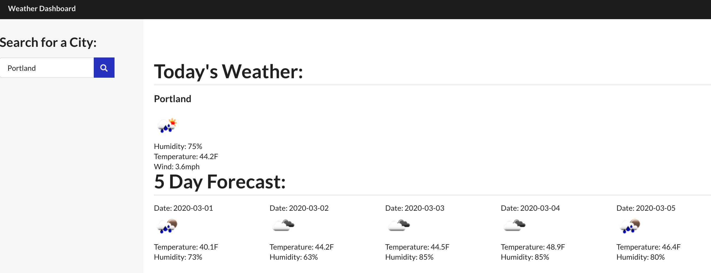

# WeatherAPI
The objective for this assignment was to create a Weather website that would allow the user to type in a city to view not only the weather for that day, but the 5 day forecast as well. This project gave me a lot of great experience using web API, JavaScript functions, and localStorage. It really reinforced JavaScript principles for me and allowed me to further develop my skills. I also decided to try my skills at Semantic UI, so that was something I began to learn and use. 
 

This assignment utilized JavaScript, Semantic UI, and . 

Here is a link to my GitHub project: 

 https://laurendoss.github.io/WeatherAPI/

Here is a screenshot of my project: 
